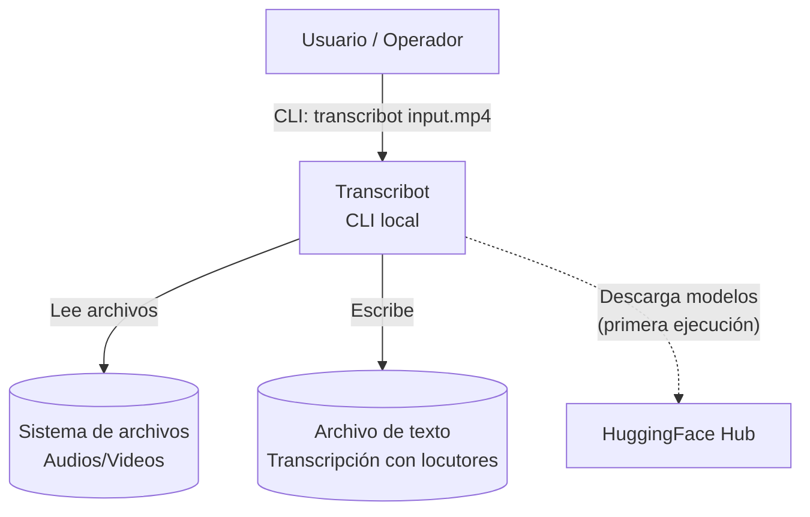
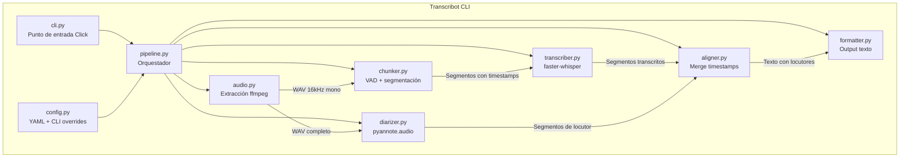
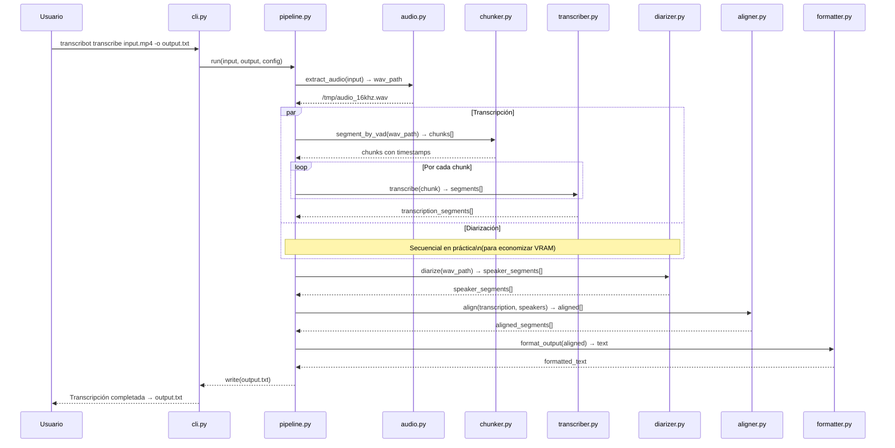
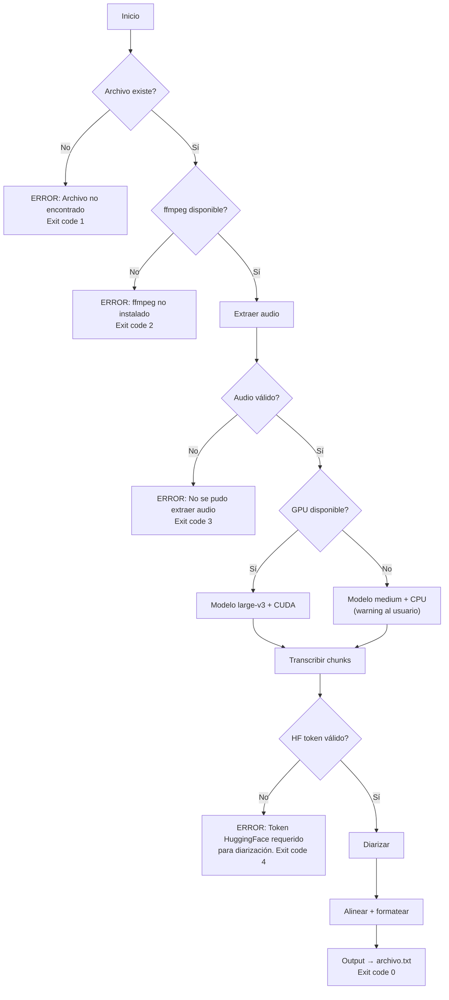

# Arquitectura

## Diagrama de Contexto (C4 - Nivel 1)



## Diagrama de Contenedores (C4 - Nivel 2)



## Diagrama de Secuencia — Flujo Principal



## Estructura de Carpetas

```
transcribot/
├── pyproject.toml              # Metadata, dependencias, entry points
├── README.md                   # Setup, uso, requisitos de HF token
├── config/
│   └── default.yaml            # Defaults: modelo, chunk_size, idioma, compute_type
├── src/
│   └── transcribot/
│       ├── __init__.py         # Versión
│       ├── cli.py              # Comandos Click (transcribe, info)
│       ├── config.py           # Carga YAML + merge con CLI args
│       ├── pipeline.py         # Orquestador principal del flujo
│       ├── audio.py            # Extracción de audio con ffmpeg/pydub
│       ├── chunker.py          # VAD segmentation + agrupación en chunks
│       ├── transcriber.py      # Wrapper de faster-whisper
│       ├── diarizer.py         # Wrapper de pyannote.audio
│       ├── aligner.py          # Merge transcripción + diarización por timestamps
│       ├── formatter.py        # Genera output texto con etiquetas de locutor
│       ├── hardware.py         # Detección GPU/CPU, selección de modelo
│       └── logger.py           # Configuración de logging
└── tests/
    ├── conftest.py             # Fixtures (audio de prueba sintético)
    ├── test_audio.py           # Tests de extracción
    ├── test_chunker.py         # Tests de segmentación VAD
    ├── test_aligner.py         # Tests de alineación
    └── test_formatter.py       # Tests de formato de salida
```

## Diagrama de Flujo de Errores

